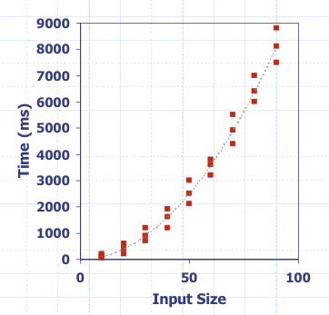
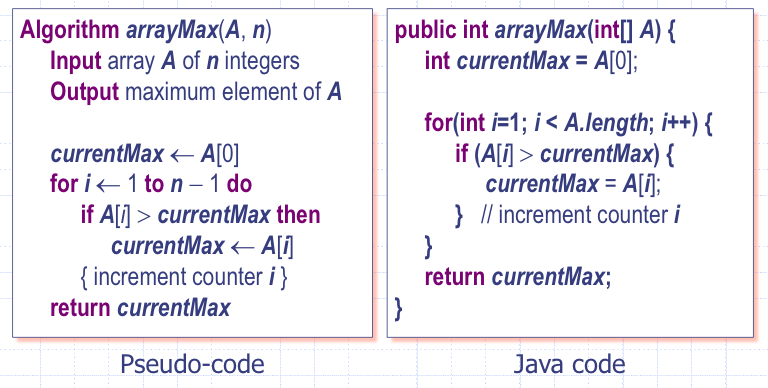
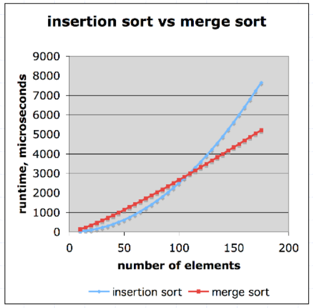
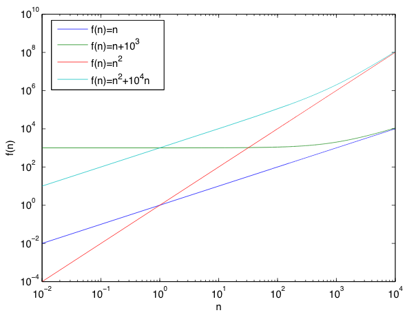
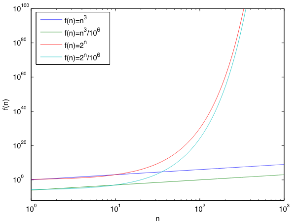

# Week 1
## Arrays
- Accessable by _indexing_
- Continuous area of storage (in most programming langauges)
    - Provides constant-time access to an indexed memory location
- Used at the core of many data structures
- Need to indicate number of elements the array has when initiasing it.
__e.g. in Java__
```java
int [] array = new int[4];
```
## Algorithm Analysis - Intro
How does an algorithm's runtime and memory usage increase with the size of the input.
- Most algorithms transform input data into output data
- Running time of an algorithm typically grows with input size
- Averagecase time is often difficult to determineq
- We focus on the worstcase running time
    - easier to analyse
    - crucial for games, finance, robotics, eScience, ..
### Space Usage
- Algorithms require space to store intermediate results
    - Space usage can vary dramatically depending on
	- algorithm implementation
	- iteration or recursion
    - Average-case space usage is often difficult to determine
    - We also focus on the worst-case space usage
	- easier to analyse
	- *crucial* for embedded systems
- Data structures need space to hold data elements
- We will focus primarily on runtime analysis

### Experimental Studies
- Write program implementing the algorithm
- Run program with inputs of varing size and composition
- Use a method lies `System.currentTimeMillis()` to measure actaul running time
- Plot the results


#### Limitations of Experiments
- Need to iplement alogryth
	- May be difficult
- Results may not be indicative of the running time on other inputs not included in the experiment
- Comparing algorithms requires the same hardware and software envionments.

## Theoretical Analy
- Use a high-level description of the algorithm
	- instead of an implementation
- Characterises running time as a function of input size, *n*
- Tkes into account akk possible inputs
	- at least those that are "bad"
- Evaluation is independent of the hardware and software envionment
### Theoretical Analysis Steps
1. Express algorithm as pseudo-code
2. Count primitive operations
3. Describe algorithm as `f(n)`
	- function of *n*
4. Preform asymptotic analysis
	- express in __asymptotic notation__
## Pseudo-Code
- High level description of an algorithm
	

## Counting Promative Operations
__Assignment__
	`int num = 10; // 1 operation`
		1. Assigning a value to a variable
	`int num = A[10]; // 2 operations`
		1. Indexing into an array
		2. Assigning a value to a variable

__Loops__
```java
while(i < 10) { // 1 operations per iteration + 1
	// operations
}
do {
	// operations
} while(i < 10) // 1 operation per iteration

for(int i = 0; i < n; i++) {		// 1 + (n + 1)
	... let counted operations = X	// n * X
}									// n
```
```java
int i = 0	// executed once
i < m		// conditional is evaluated n + 1 times
i++			// increment is evaluated n times
{/*body*/}	// X instructsions within loop are evaluated n times
```
### Describe as f(*n*) - Function of *n*
- By inspecting the psuedo-code, we can determine the **maximum** number of primatives operations executed by an algotithm as a function of the input size.
```ruby
Algorithm arrayMax(A, n)			# Operations
	currentMax <- A[0]				# 2
	for i <- 1 to n - 1 do			# 1 + 2 * n or 2 + n
		if A[i] > currentMax then	# 2 * (n - 1)
			currentMax <- A[i]		# 2 * (n - 1)
		{ increment counter i }		# n - 1
	return currentMax				# 1
Total:								# 7 * n [+ lower order terms]
```
- `arrayMax` execute seven and primitive operations in the worst case
	- a = time taken by the fastest primative operation
	- b = time taken by the slowest primative operation
- Let $T(n)$ be the worst time case of `arrayMax`
	- $a \dot 7n \le T(n) \le b \dot 7n$
- Run time $T(n)$, is bounded by two linear functions
-

# Growth Rate
- Seven functions that often appear in algoryth analysis

Name		| Math				| Found							
----------- | ----------------- | ----------------------------- 
Constant	| $\approx 1$		| 
Logarithmic	| $\approx \log_2n$ | Searching a sorted list
Linear		| $\approx n$ 		| Searching an unsorted list
N-Log-N		| $\approx n\logn$	|
Quadratic	| $\appox n^2$ 		| Nested loops
Cubic		| $\approx n^3$	 	| Nested nested loops
Exponential	| $\approx 2^n$		| Loop where the number of operations doubles each iteration

# Effect of growth rate
```ruby
n <- 64
k <- 1
for i <- 0 to n-1 do
	for j <- 0 to k-1 do
		pick()
		{ increment counter j }
	k <- k * 2
	{ increment counter i }
```
- Suppose “pick” takes 10-9s to executeq
- This harmless looking loop would take 585 years to runn
	- assuming 82 ∙ 109instructions per secq
	- Would still take 7 years if “pick” takes a single instruction(unrealistic)

## Comparision of Two Algorithms


Name | Complexity
--- | ---
Insertation sort | $$\frac{n^2}{4}$$
Merge sort | $2\log_2(n)$

If it takes merge sort 0.5s to sort a list of a million items, it would take insertation sort 40m

## Analyisis Process
- To perform an asymptotic analysis of the worst-case running time of an algorithm
	- find the worst-case number of primitive operations executed as a function of the input size –f(n)
		- since constant factors and lower-order terms do not affect the growth rate for large n they are usually disregarded when counting primitive operations
	- express this function with big-O notation

## What Difference do Lower-Order Terms Make?


## What Difference Does a Constant Factor Make?


## Big-O Notation
- Big-O notation describes an upper bound on a function
- $f(n)$ is $O(g(n))$ if $f(n)$ is asymptotically less than or equal to $g(n)$
$$\text{Given functions } f(n) \text{ and } g(n)\text{, we say that }$$
$$f(n) \text{ is } O(g(n))$$
$$\text{ if there are positive constants } c \text{ and } n_0 \text{ such that }$$
$$f(n) \le c \dot g(n) \text{ for } n \ge n_0$$

### Big-O and Growth Rate

|| $f(n) \text{is} O(g(n))$ | $g(n) \text{is} O(f(n))$
--- | --- | ---
$g(n)$ grows more | yes | __no__ |
### Big-O Rules
- __Rule 1__ - If $f(n)$ is a polynomial of degree $d$, then $f(n)$ is $O(n^d)$
	- drop lower-order terms
	- drop constant factors (coefficients)

$$\text{e.g. } 3n^4 + 7n^3 + 5 \text{ is } O(n^4)$$

- __Rule 2__ - Use the smallest possible class of functions (the "tighest" possible bound)
- "$2n$ is $O(n)$" instead of "$2n$ is $O(n^2)$"

__ Rule 3__ Use the simplest expression of the class
- "$3n + 5 \text{is} O(n)$" instead of "$3n + 5 \text{is} O(3n)$"

### Big-O Examples
$7n - 2 \text{is} O(n)$
- need c > 0 and $n_0 >= 1$ such that $7n - 2 <= c \times n$ for $N >= N_0$ true for $c = 7$ and $n_0 = 1$
$3n^3 + 20n^2 + 5 \text{is} O(n^3)$
- need c > 0 and $n_0 >= 1$ such that $3n^3 + 20n^2 + 5 <= c \times n^3$ for N >= N_0$ true for $c = 4$ and $n_0 = 21$
$3 \log(n) + 5 \ext{is} O(log(n))$
- need c > 0 and $n_0 >= 1$ such that $3 \log(n) + 5 <= c \times \log(n)$ for $n >= n_0 true for $c = 7$ and $n_0 = 1$
