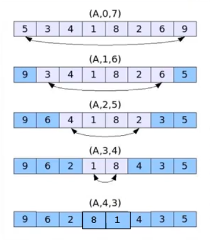
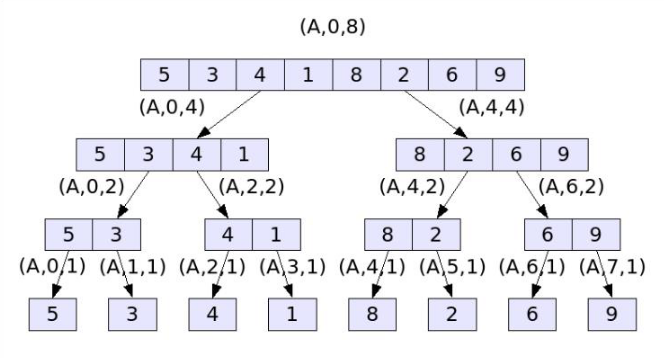

# Week 2: Recursion and Sorting 

## Recursion

### What is recursion
> Recursion (adjective: recursive) occurs when a thing is defined in terms of itself or of its type. Recursion is used in a variety of disciplines ranging from linguistics to logic. The most common application of recursion is in mathematics and computer science, where a function being defined is applied within its own definition. While this apparently defines an infinite number of instances (function values), it is often done in such a way that no infinite loop or infinite chain of references can occur. 

- from [Wikipedia the free encylopedia](https://en.wikipedia.org/wiki/Recursion)

### Recursion Pattern
- Recursion: when a method calls itself
- Classic example: factorial function

### Linear Recusion
- Test for __base cases__
	- Begin by testing for a set of base cases
	- Every possible chain of recursive calls _must_ eventually reach a base case
- Preform a single recursive call
```java
public void recursiveMethod(int n) {
	if (n <= 0) {
		return 0;
	} else if (n%2 == 0) {
		return 1 + recursiveMethod(n/2);
	} else {
		return 1 + recursiveMethod(n-1);
	}
}
```
- In linaer recursive calls it only calls one of itself
```java
public void ReverseArray(int[] A, inti, intj) {
	if(i < j) {
		inttmp= A[i];
		A[i] = A[j];
		A[j] = tmp;
		ReverseArray(A, i+1, j-1);
	}
}
```


### Defining Arguments for Recursion
- Recursive methods may require additional parameters
- We defined array reversal as `ReverseArray(A, i,  j)` not `ReverseArray(A)`
- Operands are passed forward via parameters
- Simple case: result of recursion is passed back via return

### Tail Recursion
- Recursive call as the last step
- Easily converted into iterative forms, the `ReverseArray` function aboave can be easily turned into a loop:
```java
public void ReverseArray2(int[]A, inti, intj	) {
	while( i< j ) {
		inttmp= A[i];
		A[i] = A[j];
		A[j] = tmp;
		i+= 1; j -= 1;
	}
}
```
### Binary Recursion
- Two calls for each non-base case
```java
public int BinarySum(int[]A, inti, intlen) {
	if(len== 1) {
		return A[i];
	} else {
		return BinarySum(A, i, len/2)+ BinarySum(A, i+ len/2, len/2);
	}
}
```

### Multiple Recursion

- Multiple recursion makes potentially many recursive calls

### Recursion Activity
- Use recursion to design an algorithm that sorts an array of n integers
- We will call this selectionSort
Base Case
- `n = 1`
	- Single-element input
	- Nothing to sort!
Recursive Case
- Scan each element of the arrfasdfasdfay – find the largest $(e_{\text{max}}i$))

    |7|5|3|5|7|8|6|5|1|2|
	|-|-|-|-|-|-|-|-|-|-|
	||||||^|
- Swap $e_\text{max}$with the last element of the array

    |7|5|3|5|7|2|6|5|1|8|
	|-|-|-|-|-|-|-|-|-|-|
	||||||^||||^|
- Repeat this process on the first $n -1$ elements

    |7|5|3|5|7|2|6|5|1|
	|-|-|-|-|-|-|-|-|-|
```ruby
Algorithm selectionSort(A, n)
	if n > 1 then
		maxIndex <- 0
		for i := 1 to <- 1 do
			if A[i] > A[maxIndex] then
				maxIndex <- i
		swap(A[maxIndex], A[n –1])
		selectionSort(A, n -1)
```

